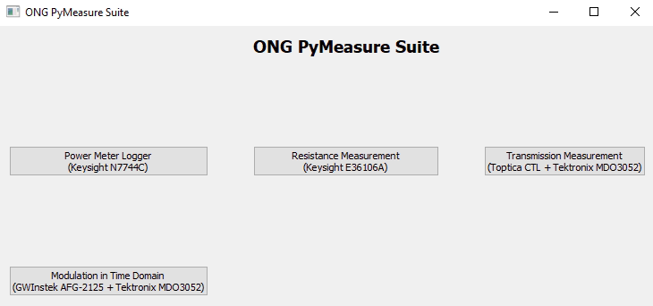

## ONG PyMeasure Suite ##

Collection of automated experiments and instrument communication protocols using the open-source library [PyMeasure](https://pymeasure.readthedocs.io/en/latest/).

## Overview ##

### Collection of Measurements
By running the main.py file, an overview of all implemented automated experiments is given. Note that the instruments neccessary for the experiments are listed also and need to be properly connected.

## Requirements ##

- PyMeaysure 0.9.0 and its dependencies
- PyQt5 5.15.4

